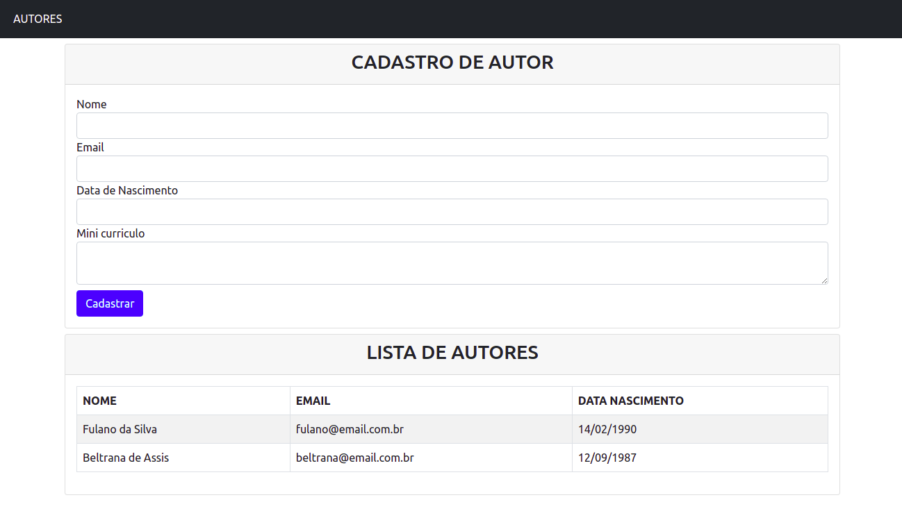

# Livraria

O objetivo deste repositório é desenvolver o projeto final do Bootcamp Java da [Alura](https://www.alura.com.br/bootcamp/back-end-java/matriculas-abertas) em 12 semanas, a partir de 31/08/2021

#### Primeiro Módulo

O projeto do primeiro é a construção de uma aplicação Java Web para cadastrar e listar autores de livros utilizando Servlet, JSP e JDBC,

